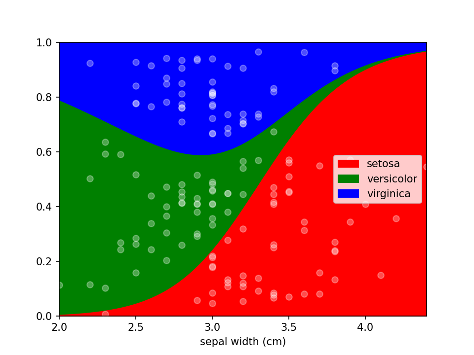

# lorepy: Logistic Regression Plots for Python

Logistic Regression plots are used to plot the distribution of a categorical dependent variable in function of a 
continuous independent variable.


## Installation

```shell
pip install lorepy
```

## Usage

Data needs to be provided as a DataFrame and the columns for the x (independent continuous) and y (dependant categorical)
variables need to be defined. Here the iris dataset is loaded and converted to an appropriate DataFrame. Once the data
is in shape it can be plotted using a single line of code ```loreplot(data=iris_df, x="sepal width (cm)", y="species")```.

```python
from lorepy import loreplot

from sklearn.datasets import load_iris
import matplotlib.pyplot as plt
import pandas as pd

iris_obj = load_iris()
iris_df = pd.DataFrame(iris_obj.data, columns=iris_obj.feature_names)

iris_df["species"] = [iris_obj.target_names[s] for s in iris_obj.target]

loreplot(data=iris_df, x="sepal width (cm)", y="species")

plt.show()
```

## Options

While lorepy has very few customizations, it is possible to pass arguments through to Pandas' 
[DataFrame.plot.area](https://pandas.pydata.org/docs/reference/api/pandas.DataFrame.plot.area.html)
and Matplotlib's [pyplot.scatter](https://matplotlib.org/stable/api/_as_gen/matplotlib.pyplot.scatter.html) to change
the aesthetics of the plots.

### Disable sample dots

Dots indicating where samples are located can be en-/disabled using the ```add_dots``` argument.

```python
loreplot(data=iris_df, x="sepal width (cm)", y="species", add_dots=False)
plt.show()
```


### Custom styles

Additional keyword arguments are passed to Pandas' [DataFrame.plot.area](https://pandas.pydata.org/docs/reference/api/pandas.DataFrame.plot.area.html).
This can be used, among other things, to define a custom colormap. For more options to customize these plots consult
Pandas' documentation.

```python
from matplotlib.colors import ListedColormap

colormap=ListedColormap(['red', 'green', 'blue'])

loreplot(data=iris_df, x="sepal width (cm)", y="species", colormap=colormap)
plt.show()
```



Using ```scatter_kws``` arguments for [pyplot.scatter](https://matplotlib.org/stable/api/_as_gen/matplotlib.pyplot.scatter.html)
can be set to change the appearance of the sample markers.

```python
scatter_options = {
    's': 20,                  # Marker size
    'alpha': 1,               # Fully opaque
    'color': 'black',         # Set color to black
    'marker': 'x'             # Set style to crosses
}

loreplot(data=iris_df, x="sepal width (cm)", y="species", scatter_kws=scatter_options)
plt.show()
```


You can use LoRePlots in subplots as you would expect.

```python
fig, ax = plt.subplots(1,2, sharex=False, sharey=True)
loreplot(data=iris_df, x="sepal width (cm)", y="species", ax=ax[0])
loreplot(data=iris_df, x="petal width (cm)", y="species", ax=ax[1])

ax[0].get_legend().remove()
ax[0].set_title("Sepal Width")
ax[1].set_title("Petal Width")

plt.savefig('./docs/img/loreplot_subplot.png', dpi=150)
plt.show()
```

