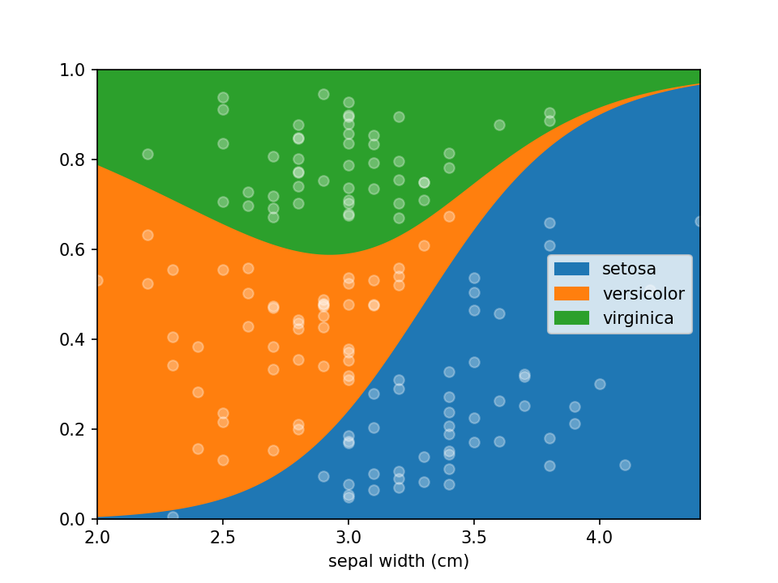

# Why use lorepy over histograms

The Iris dataset, shown in a loreplot below, is visualized using a few different options further down this page. Note
how using stacked bar plots in some cases can distort the data.

## A threshold is used to separate the data

In the plot below, individuals are separated into "large" and "small" groups based on an arbitrary threshold for sepal 
width. This approach can obscure how sepal width is distributed within species, particularly for the *virginica* species.

## Using bins with equal range

Here, individuals are divided into six equal segments (bins) based on sepal width. The plot below emphasizes the small 
number of *setosa* specimens with small sepals, showing how they disproportionately influence the plot.

## Using percentiles

The plot below slices the data into percentile ranks, which leads to bins of varying widths. For instance, the largest bin 
covers a range of ~1 cm, while others span just 1-2 mm. This can distort the perception of data distribution.

